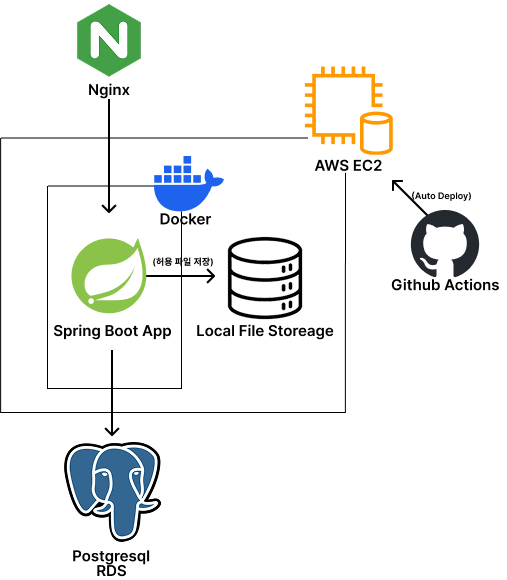

# 파일 확장자 차단 시스템 

7개의 고정 확장자와 추가 확장자를 금지에 서버에 위협이 되는 파일의 업로드를 차단하는 시스템 입니다. 

## 서비스 접속
- **메인**: https://iloveflow.shop
- **API 문서**: https://iloveflow.shop/swagger-ui/index.html

##  기술 스택
- **Backend**: Spring Boot 3.2.1, Java 17
- **Database**: PostgreSQL (Production), H2 (Development)
- **Frontend**: HTML5, CSS3, JavaScript, WebSocket
- **Infrastructure**: AWS EC2, RDS, Docker, Nginx
- **CI/CD**: GitHub Actions
- **Security**: Let's Encrypt SSL

## 주요 기능

### 확장자 관리
- **고정 확장자 토글 차단**: 7가지 위험 확장자 (bat, cmd, com, cpl, exe, scr, js)
- **커스텀 확장자**: 최대 200개 사용자 정의 확장자 관리
- **확장자 검증**: 다중 확장자 우회 공격 방지 (예: `바이러스.txt.exe`)
- **파일명 정규화**: 대소문자 통합 처리

서버 스토리지가 작아 100mb가 넘는 파일은 업로드를 제한했습니다.

### 파일 관리
- **파일 업로드 가능**
- **UUID 기반 파일명 충돌 방지**
- **자동 파일 정리**
: 차단 확장자 설정 시 기존 차단된 확장자를 가진 파일은 자동으로 삭제합니다.

- **삭제 예외 보호**: 중요한 기능은 자동 파일 정리를 방지해야 하기 때문에 삭제 예외를 설정할 수 있습니다.

- **파일 다운로드**

### 보안
- **실시간 감사 로그**: WebSocket 기반 실시간 차단 알림
- **상세 추적 정보**: IP 주소 추적, 차단 사유, 타임스탬프 기록

## 시스템 아키텍처

